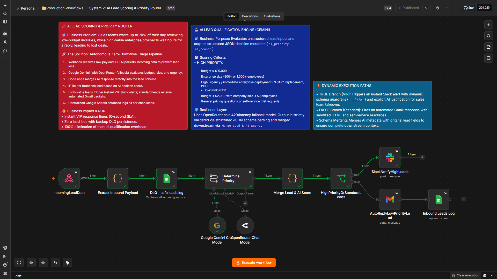
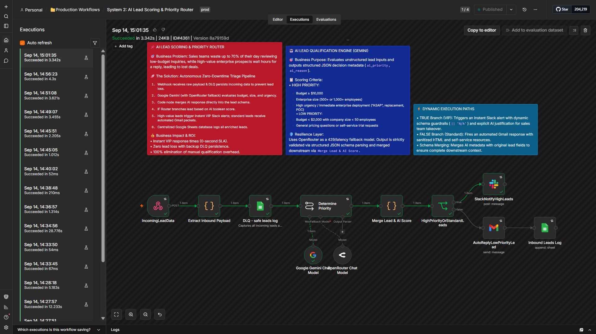
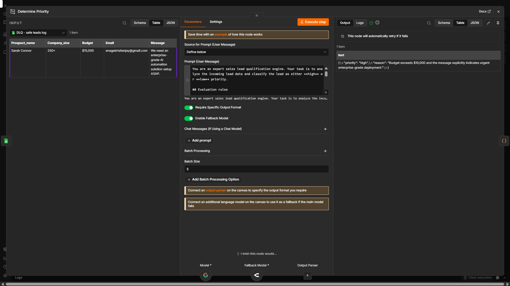

# 📌 AI Lead Scoring & Priority Router

An automated AI triage engine built with **n8n** and **Google Gemini AI** (with **OpenRouter** fallback) to automatically qualify inbound sales leads and route high-value opportunities to sales teams in real time.

---

## 🎯 Business Problem

Sales teams waste up to 70% of their day reviewing low-budget inquiries, while high-value enterprise prospects wait hours for a response. This delay leads to lost deals and lower pipeline conversion rates.

---

## 💰 Business Impact & ROI

* **⚡ 0-Second Lead Triage:** Eliminates the 70% time waste sales teams spend sifting through low-budget inquiries by instantly evaluating budget, company size, and urgency upon form submission.
* **🚀 Maximized Pipeline Conversion:** Guarantees VIP enterprise prospects (Budget $\ge$ $10,000) trigger instant Slack alerts with AI reasoning for immediate sales intervention.
* **🛡️ Zero Lead Loss:** Integrates `DLQ - safe leads log` to persist incoming raw payloads into a database, maintaining system resilience if upstream processing fails.
* **🤖 100% Qualification Automation:** Replaces manual lead reviews with zero-latency AI scoring and central database sync in Google Sheets, freeing reps to focus exclusively on closing deals.

---

## 🚀 System Architecture & Node Breakdown

This automated n8n workflow operates through a structured execution pipeline:

* **1. Webhook Intake & Payload Extraction (`IncomingLeadData` & `Extract Inbound Payload`):**
  * **What it does:** Dynamically receives incoming raw form submissions and extracts structured parameters for processing.
  * **Value:** Provides a zero-latency entry point for inbound leads.

* **2. Dead Letter Queue Backup (`DLQ - safe leads log`):**
  * **What it does:** Captures raw webhook inputs into a backup database persistence layer before downstream steps run.
  * **Value:** Guarantees zero lead loss during unexpected system downtime, model rate limits, or API outages.

* **3. AI Lead Qualification Engine (`Google Gemini` + `OpenRouter` Fallback):**
  * **What it does:** Evaluates unstructured lead parameters against strict criteria (Budget $\ge$ $10,000, 500+ employees, urgency) and outputs structured decision metadata (`ai_priority`, `ai_reason`). Uses OpenRouter as an instant fallback model during 429 rate limits or network spikes.
  * **Value:** Replaces subjective manual qualification with deterministic, automated AI scoring.

* **4. Schema Validation & Data Merging (`Determine Priority` & `Merge Lead & AI Score`):**
  * **What it does:** Parses structured JSON schemas and merges AI metadata directly back into original lead attributes without payload displacement.
  * **Value:** Preserves full lead context for downstream routing and reporting.

* **5. Multi-Tier Score Router (`HighPriorityOrStandardLeads` IF Gate):**
  * **What it does:** Directs leads based on boolean priority evaluation:
    * **`VIP Leads (True)`:** Executes `SlackNotifyHighLeads` with schema guardrails (`|| 'N/A'`) to post instant alerts with explicit AI reasoning for sales team takeover.
    * **`Standard Leads (False)`:** Executes `AutoReplyLowPriorityLead` to dispatch an automated Gmail response with sanitized HTML and self-service resources.
  * **Value:** Maximizes speed-to-lead for high-value enterprise prospects while automating routine inquiries.

* **6. Centralized Database Sync (`Inbound Leads Log`):**
  * **What it does:** Appends all enriched lead records directly to a central Google Sheets CRM log.
  * **Value:** Provides an organized audit log for sales follow-ups and performance analytics.

---

## 📹 Loom Video Walkthrough

Watch the 3-minute project demo:

👉 [AI Lead Scoring & Priority Router Demo](https://www.loom.com/share/38164c8a840f4076b3ac0ec62a26e3ce)

---

## 🧪 Live Execution Proof & Payload Verification

Here is the verified execution log confirming successful end-to-end data processing, AI scoring, and multi-channel delivery.

### 1. n8n AI Lead Scoring Execution History

* Figure 1: n8n execution history validating 0-latency AI prompt processing and automated routing.

### 2. LLM Priority Parameter Schema & Prompt Layout

* Figure 2: Structured JSON schema and prompt parameter layout enforcing deterministic AI priority outputs.

---

## 🛠️ Tech Stack & Integrations

* **Automation Engine:** n8n (Self-Hosted / Production Workflow)
* **AI Intelligence:** Google Gemini Chat Model & OpenRouter Fallback Model (Structured Outputs)
* **Notifications:** Slack API (`SlackNotifyHighLeads`)
* **Email Communication:** Gmail API (`AutoReplyLowPriorityLead`)
* **Database & Resiliency Layer:** Google Sheets API (`Inbound Leads Log`), Supabase/Database DLQ (`DLQ - safe leads log`)

---

## 📋 Scoring Criteria

* **High Priority (VIP):**
  * Budget $\ge$ $10,000
  * Enterprise size (500+ or 1,000+ employees)
  * High urgency / immediate enterprise deployment ("ASAP", replacement, POC)
* **Low Priority (Standard):**
  * Budget < $2,000 with company size < 50 employees
  * General pricing inquiries or trial requests

---

## ⚙️ How to Import

1. Download the `workflow.json` file from this repository.
2. Open your n8n canvas $\rightarrow$ **Workflows** $\rightarrow$ **Import from File**.
3. Configure your credentials for **Google Gemini**, **OpenRouter**, **Slack**, **Gmail**, and **Google Sheets**.
4. Set workflow status to **Active** and link your production webhook URL to your inbound lead capture forms.

---

## 📈 Engineering Roadmap & Milestone

* **Roadmap Phase:** Phase 2 (Automation Engineering)
* **Sprint Tracker:** Sprint 3 — JSON Data Engineering & Portfolio Documentation
* **Build Milestone:** Completed (Day 98/153)
