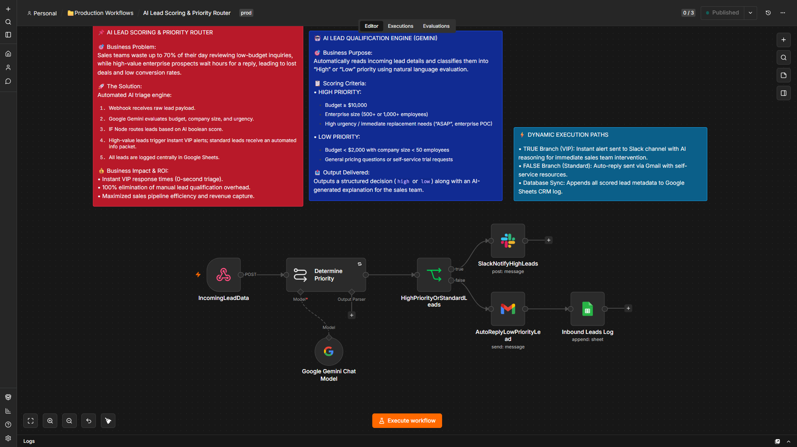
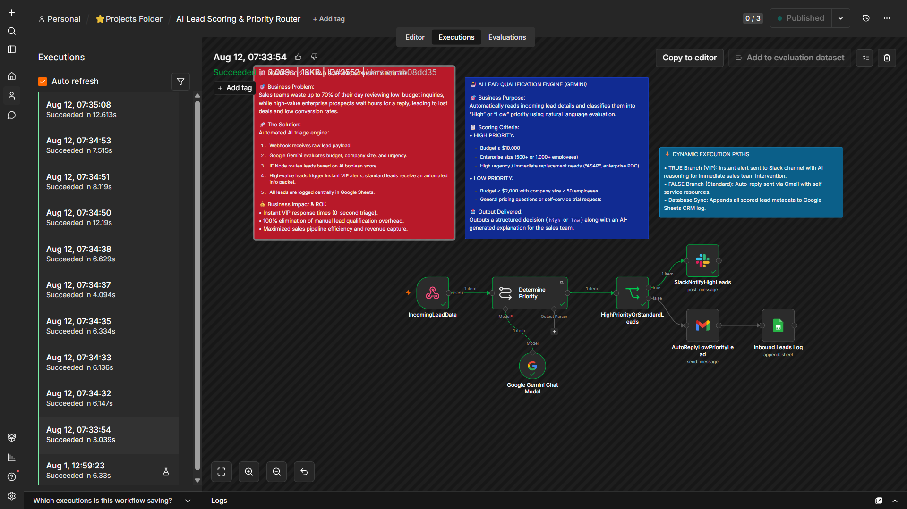

# 📌 AI Lead Scoring & Priority Router

An automated AI triage engine built with **n8n** and **Google Gemini AI** to automatically qualify inbound sales leads and route high-value opportunities to sales teams in real time.

---

## 🎯 Business Problem
Sales teams waste up to 70% of their day reviewing low-budget inquiries, while high-value enterprise prospects wait hours for a response. This delay leads to lost deals and lower pipeline conversion rates.

## 💰 Business Impact & ROI

* **⚡ 0-Second Lead Triage:** Eliminates the 70% time waste sales teams spend sifting through low-budget inquiries by instantly evaluating budget, company size, and urgency upon form submission.
* **🚀 Maximized Pipeline Conversion:** Guarantees VIP enterprise prospects (Budget $\ge$ $10,000) trigger instant Slack alerts with AI reasoning for immediate sales intervention.
* **🤖 100% Qualification Automation:** Replaces manual lead reviews with zero-latency AI scoring and central database sync in Google Sheets, freeing reps to focus exclusively on closing deals.

## 🚀 Solution Overview
This automated n8n workflow acts as an instant lead triage system:
1. **Webhook Trigger:** Receives raw lead payloads dynamically.
2. **AI Lead Scoring:** Evaluates budget, company size, and urgency using Google Gemini.
3. **Dynamic Routing:**
   * **VIP Branch (True):** Posts immediate alerts with AI reasoning to Slack for sales intervention.
   * **Standard Branch (False):** Automatically sends a self-service resource packet via Gmail.
4. **CRM Sync:** Logs all scored leads centrally into Google Sheets.

---

## 📹 Loom Video Walkthrough 
Watch the 3-minute project demo: 👉 [AI Lead Scoring & Priority Router Demo](https://www.loom.com/share/38164c8a840f4076b3ac0ec62a26e3ce)

## 🧪 Live Execution Proof & AI Output Verification

Here is the verified n8n execution log confirming real-time prompt evaluation, structured JSON qualification scoring, and multi-branch routing.

### 1. n8n AI Lead Scoring Execution History

*Figure 1: n8n execution history validating 0-latency AI prompt processing and automated routing.*

---

## 🛠️ Tech Stack & Integrations
* **Automation Engine:** n8n
* **AI Model:** Google Gemini Chat Model
* **Notifications:** Slack API
* **Email Communication:** Gmail API
* **Database/CRM:** Google Sheets API

---

## 📋 Scoring Criteria
* **High Priority (VIP):**
  * Budget $\ge$ $10,000
  * Enterprise size (500+ or 1,000+ employees)
  * High urgency or immediate replacement needs
* **Low Priority (Standard):**
  * Budget < $2,000 with company size < 50 employees
  * General pricing inquiries or trial requests

---

## ⚙️ How to Import
1. Download the `workflow.json` file from this repository.
2. Open your n8n instance.
3. Go to **Workflows** $\rightarrow$ **Import from File**.
4. Configure your credentials for Google Gemini, Slack, Gmail, and Google Sheets.

---

### 📈 Engineering Roadmap & Milestone
* **Roadmap Phase:** Phase 2 (Automation Engineering)
* **Sprint Tracker:** Sprint 2 — API Integration & Error Workflows
* **Build Milestone:** Completed (Day 47/153)
